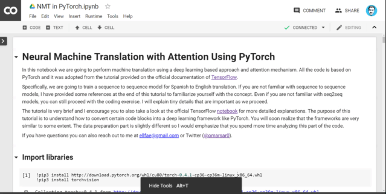

## Neural Machine Translation with Attention Using PyTorch
In this notebook we are going to perform machine translation using a deep learning based approach and attention mechanism. All the code is based on PyTorch and it was adopted from the tutorial provided on the official documentation of [TensorFlow](https://colab.research.google.com/github/tensorflow/tensorflow/blob/master/tensorflow/contrib/eager/python/examples/nmt_with_attention/nmt_with_attention.ipynb). 

Specifically, we are going to train a sequence to sequence model for Spanish to English translation. If you are not familiar with sequence to sequence models, I have provided some references at the end of this tutorial to familiarize yourself with the concept. Even if you are not familiar with seq2seq models, you can still proceed with the coding exercise. I will explain tiny details that are important as we proceed. 

The tutorial is very brief and I encourage you to also take a look at the official TensorFlow [notebook](https://colab.research.google.com/github/tensorflow/tensorflow/blob/master/tensorflow/contrib/eager/python/examples/nmt_with_attention/nmt_with_attention.ipynb) for more detailed explanations. The purpose of this tutorial is to understand how to convert certain code blocks into a deep learning framework like PyTorch. You will soon realize that the frameworks are very similar to some extent. The data preparation part is slightly different so I would emphasize that you spend more time analyzing this part of the code. 

[Colab Notebook](https://colab.research.google.com/drive/1uFJBO1pgsiFwCGIJwZlhUzaJ2srDbtw-)

If you have questions you can also reach out to me at ellfae@gmail.com or Twitter ([@omarsar0](https://twitter.com/omarsar0)). See a screenshot below of the notebook:

